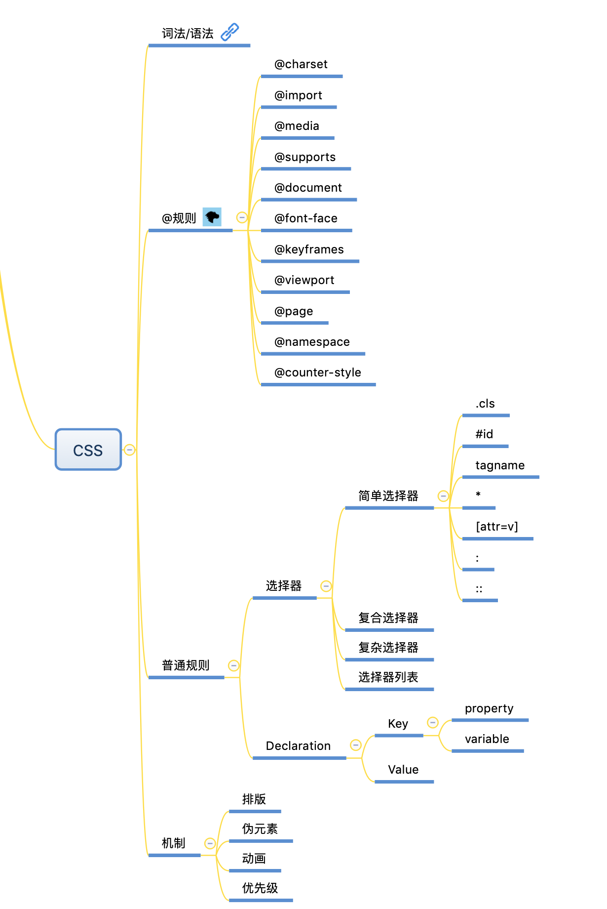

# 每周总结可以写在这里

## 本周作业

- 跟着课程完成 [toy-browser](../week05/toy-browser)
- 画一个 CSS 的脑图
  
- 跟着课程跑一跑两个小实验程序

# 重学 CSS

## CSS 语法的研究

CSS2.1 语法标准：

1. [https://www.w3.org/TR/CSS21/grammar.html#q25.0](https://www.w3.org/TR/CSS21/grammar.html#q25.0)
2. [https://www.w3.org/TR/css-syntax-3](https://www.w3.org/TR/css-syntax-3)

**CSS 语法整体架构**

查看语法标准，可以知道 CSS 的顶层样式由两种规则组成的规则列表构成，一种被称为 `at-rule`，也就是 `at` 规则，另一种是 `qualified rule`，也就是普通规则。

## CSS at 规则的研究

CSS 中的 at 规则：

- @charset
  - 用于提示 CSS 文件使用的字符编码形式
- @import
  - 用于引入 CSS 文件
- @namespace
  - 表示内部的 CSS 选择器都带上特定的命名空间

下面的 at 规则可以嵌套使用

- @media
  - 媒体查询，在不同的设备或尺寸应用不同的样式规则
- @font-face
  - 自定义字体
- @keyframes
  - 定义动画关键帧
- @viewport
  - 设置视口特性，目前兼容性不好
- @document
  - 根据文档判断是否满足使用条件，CSS4 的规范
- @supports
  - 检查环境特性
- @page
  - 介绍在打印文档时将应用的样式
- @counter-style
  - 定义列表项的表现
- @font-feature-values

## CSS 普通规则的结构

`qualified rule` 主要由选择器和声明区块构成，声明区块由属性和值构成。

- Selector（选择器）
- Declaration（声明 `属性: 值`）
  - Key（[属性](https://www.w3.org/TR/css-variables/)）
  - Value（[值](https://www.w3.org/TR/css-values-4/)）
    - property（值的类型）
    - variable（函数）
